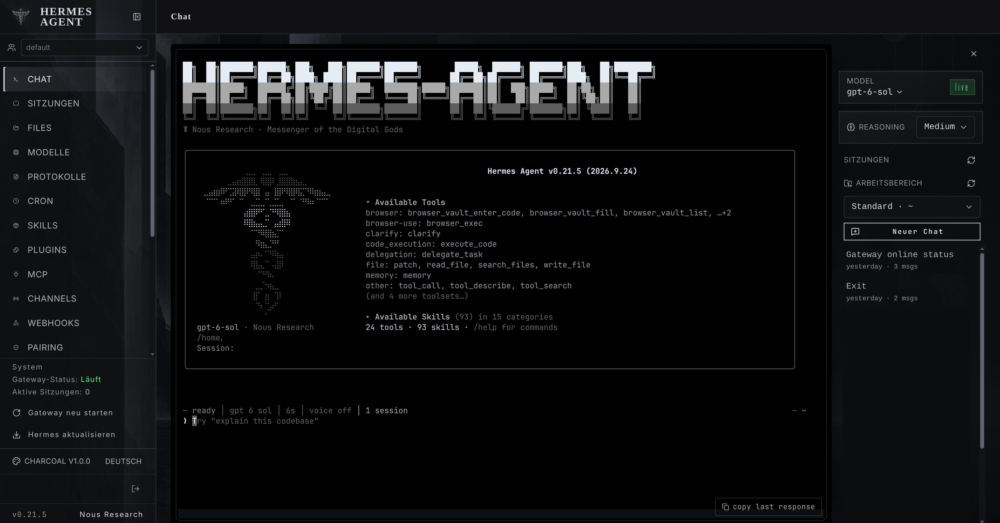
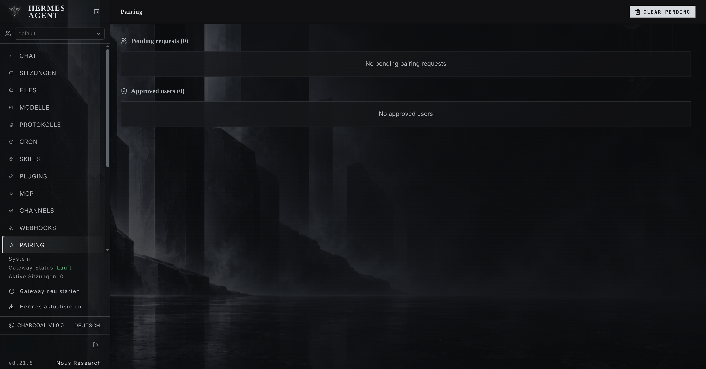
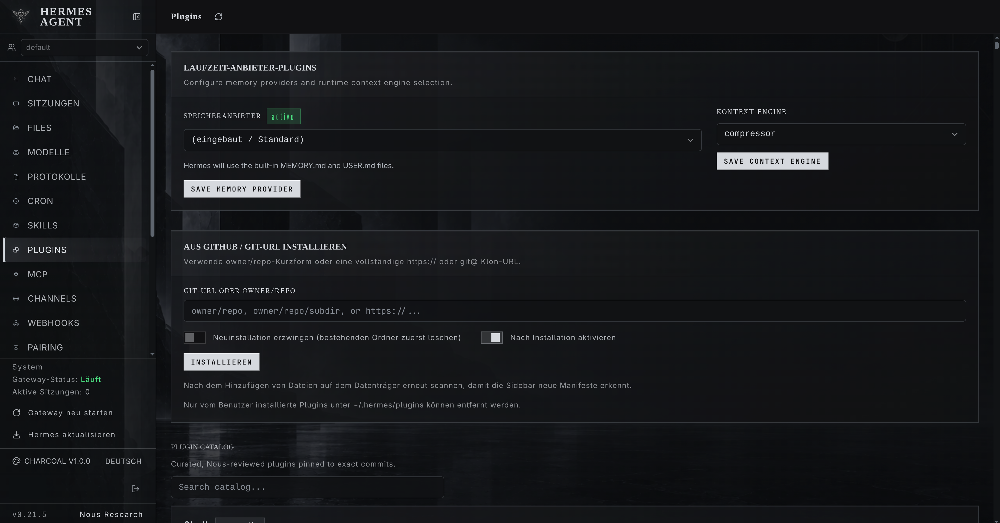

# Hermes Charcoal Dashboard Theme

A monochrome theme for the Hermes web dashboard with black, graphite, and cold-silver look.

> Unofficial community theme for Hermes Agent.

A visual-only Dashboard-Theme. It does not modify Hermes Core, the backend, sessions, PTY behavior, or navigation. No remote fonts, external assets, or additional runtime dependencies are required.

## Preview







## Installation

Charcoal consists of two parts:

- the dashboard theme YAML
- the `hermes-charcoal-visuals` dashboard plugin, which provides the bundled artwork and header emblem

Both must be installed for the complete appearance.

### Option A — Let Hermes install it

Extract the release and give Hermes the path to the extracted folder.

You can ask:

> Install the Charcoal dashboard theme and its visual plugin from this folder into the Hermes home used by the running dashboard. Preserve all existing themes, plugins, and configuration. Rescan dashboard plugins after installation, select Charcoal, set the optional font override to Theme default, and verify that both the background and silver Hermes emblem appear.

### Option B — Install manually

1. Find the Hermes home used by the **running dashboard**.

   If `HERMES_HOME` is set for the dashboard process, use that directory. Otherwise it is usually:

   ```text
   ~/.hermes
   ```

   Note: the dashboard's Hermes home may differ from the home used by your current Hermes agent profile.

2. Copy the theme:

   ```text
   theme/charcoal-v1.0.0.yaml
   ```

   to:

   ```text
   <hermes-home>/dashboard-themes/charcoal-v1.0.0.yaml
   ```

3. Copy the complete plugin directory:

   ```text
   plugin/hermes-charcoal-visuals/
   ```

   to:

   ```text
   <hermes-home>/plugins/hermes-charcoal-visuals/
   ```

   Keep the directory name exactly `hermes-charcoal-visuals`. The theme references its bundled assets through that dashboard-local plugin path.

4. If your Hermes installation gates user plugins through `plugins.enabled`, ensure `hermes-charcoal-visuals` is included **without removing any existing enabled plugins**.

   Do not rely on:

   ```text
   hermes plugins enable hermes-charcoal-visuals
   ```

   for this dashboard-only plugin. Some Hermes versions may not recognize it through that command.

5. Rescan or reload dashboard plugins.

6. Refresh the dashboard and choose **Charcoal** in the theme picker.

7. For the intended typography, set the optional dashboard font override to **Theme default**.

8. Press **Ctrl+Shift+R** to perform a hard refresh after installation. If cached styling remains, repeat the hard refresh once.

## Verify the installation

Confirm that:

- **Charcoal** appears in the theme picker
- the full-page Charcoal background is visible
- the silver Hermes emblem appears in the header
- switching to a built-in theme removes Charcoal-specific styling
- switching back to Charcoal restores it

### Background works, but the emblem is missing

This usually means the theme loaded but the visual plugin did not fully reload.

Try this sequence:

1. Rescan or reload dashboard plugins.
2. Press **Ctrl+Shift+R**.
3. If necessary, repeat the hard refresh once.
4. Select Charcoal again and verify the emblem.

## Terminal look

Charcoal is designed to pair with Hermes' monochrome terminal skin.

Inside a Hermes session, run:

```text
/skin mono
```

Charcoal styles the surrounding Chat host frame; Hermes still owns PTY and terminal rendering.

## Package contents

```text
README.md
LICENSE

theme/
  charcoal-v1.0.0.yaml

plugin/
  hermes-charcoal-visuals/
    dashboard/
      manifest.json
      dist/
      assets/
        core/
          charcoal-backdrop.png
          charcoal-emblem.png
          charcoal-symbol.png
          charcoal-sidebar.png
          charcoal-overlay.png
          charcoal-surface.png
          charcoal-grain.png
```

## Uninstall

1. Switch to a built-in Hermes theme.
2. Remove:

   ```text
   <hermes-home>/dashboard-themes/charcoal-v1.0.0.yaml
   <hermes-home>/plugins/hermes-charcoal-visuals/
   ```

3. If you manually added `hermes-charcoal-visuals` to `plugins.enabled`, remove only that entry and preserve all other enabled plugins.
4. Refresh the dashboard.

## Notes

- Charcoal is intentionally monochrome; success, warning, and destructive states remain lightly differentiated for usability.
- On some Hermes versions, terminal palette fields may be ignored by the dashboard runtime. `/skin mono` provides the intended terminal appearance.
- Browser caching can make an updated theme appear incomplete. Use **Ctrl+Shift+R** after installation or updates.
- Future Hermes dashboard changes may require theme selector updates.

## License

Released under the MIT License. See [LICENSE](LICENSE).
